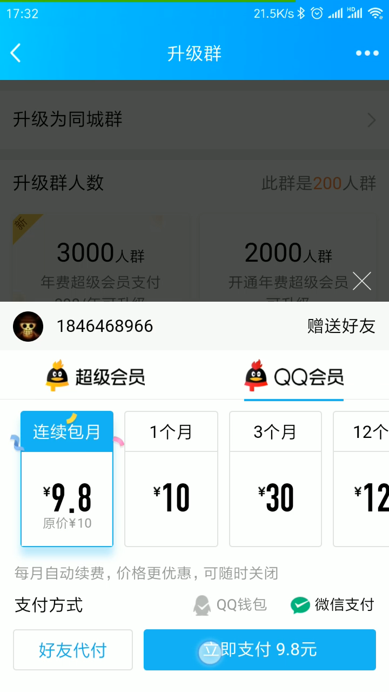

**Xiang Wang @ 2019-08-29 17:34:38**

# accuse-QQ
记录一次投诉腾讯QQ的历程

# 基础信息
* 金额 9.5
* 商品 QQ会员
* 交易时间 2019-08-29 17:09:31
* 交易订单 10000234016012201908291531558503
* 商户订单 `qqpro_20190829210436327`
* 投诉内容: 因为我创建的一个QQ群人满了，所以我想升级一下QQ群的最大人数。我于2019年8月29日在QQ平台上升级群（点开群聊天 - 点击右上角菜单按钮 - 点击管理群 - 点击升级群 - 点击1000人群下的升级按钮） ，点击购买后，出现仍然不能升级群问题，告诉我要开通年费超级会员才可以。侵害了我的知情权益，我的诉求是:
    1. 第一退还我支付的9.5元。
    2. 第二当用户点击升级群时，应该弹出默认购买年费超级会员的选择，不应该显示购买普通会员的选项。因为购买普通会员并不能升级群。

# 照片视频资料
  
视频地址 [video.mp4](video.mp4)

# 经过
1. 先在QQ里面帮助，关于里面找，都没找到客服。最后只能在反馈里面提交了一个反馈。
2. 访问 [http://show.s.315.100ec.cn/](http://show.s.315.100ec.cn/) 投诉
